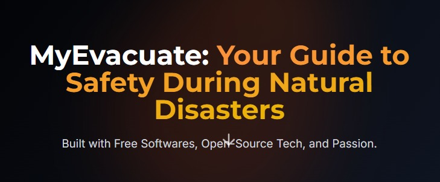
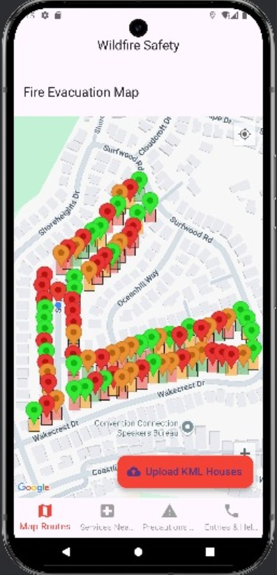
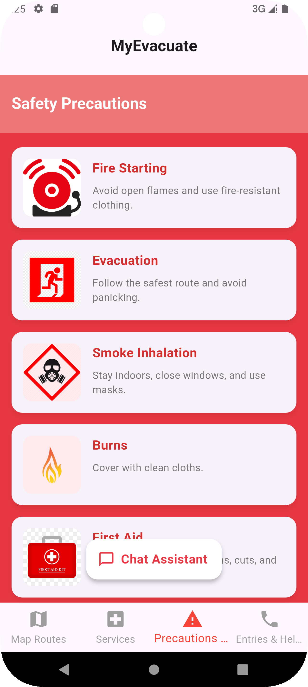
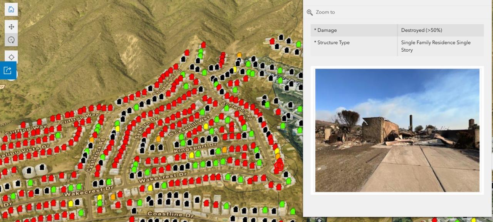

# 🚨 MyEvacuate – AI-Powered Emergency Evacuation Assistant

MyEvacuate is a smart, AI-driven platform designed to guide individuals to safety during natural disasters and crisis situations. Whether it's a fire, flood, or earthquake, **MyEvacuate empowers users with real-time intelligence, optimized evacuation routes, and personalized alerts** to escape danger zones quickly and safely.



---

## 🎥 Demo Video  
📽️ Watch MyEvacuate in action:  
➡️ [Click to watch](wildfire/assets/demo.mp4)

---

## 🧠 Built with AI at its Core

We use machine learning and geospatial intelligence to make **disaster response smarter, faster, and more personal.**

---

## 🚀 Features

### 🧭 Wildfire Detection & Evacuation
- Live wildfire zone tracking using **NASA FIRMS API**
- Dynamic evacuation route planning via **OSMnx + NetworkX**
- Fire zones, user location, and safe paths shown on a live map

### 🧃 Emergency Resources Near You
- Nearby **water**, **food**, and **shelter** points auto-detected
- Map-based emergency resource discovery

### 🧑‍🤝‍🧑 Community Chat & Support
- Real-time chat within a **100km radius**
- Users can:
  - Report fire/smoke
  - Share rescue info
  - Request supplies
  - Offer emotional support

### 🧠 AI Chat Assistant
- Powered by **Dialogflow / LLM API**
- Helps users with:
  - Fire safety tips
  - Trapped situations
  - Helpline guidance

### 🗺️ AI-Based Route Optimization
> Our AI suggests the **safest evacuation paths** by evaluating:
- Real-time traffic & blockages
- Fire & hazard zone overlays
- Crowd-sourced alerts
- Historical disaster data

### 📍 Risk Zone Detection using AI
> Pre-trained ML models classify:
- Satellite imagery and fire intensity
- Drone visuals (future integration)
- Temporal disaster risk zones

### 📢 NLP-based Alert Prioritization
> AI scans and filters alerts from:
- Government feeds
- Social media & news
- User reports

The result: **Smart, relevant, and urgent warnings** tailored for each user.

### 👥 AI-Powered Personalization
- Special routes for the elderly, children, or disabled
- Multi-language support + voice instructions
- Auto-generated checklists based on individual needs

---

## 🛠️ Tech Stack

| Tech                 | Role                                 |
|----------------------|--------------------------------------|
| **FastAPI**          | Backend APIs & AI endpoints          |
| **Firebase**         | Real-time user location & notifications |
| **Mapbox / Leaflet.js** | Map visualization & navigation   |
| **spaCy + HuggingFace** | NLP-based alert processing        |
| **OSMnx + NetworkX** | Pathfinding & route optimization     |
| **Tailwind CSS**     | Responsive UI styling                |

---

## 📸 Screenshots

| Evacuation Map | Alert Classification | AI Risk Zones | IoT Integration | Community Chats |
|----------------|----------------------|----------------|-----------------|-----------------|
|  |  |  |  |  |


---

## 🧪 How to Run Locally

```bash
git clone https://github.com/hirah-ma/MyEvacuate
cd myevacuate
pip install -r requirements.txt
uvicorn app:main --reload
